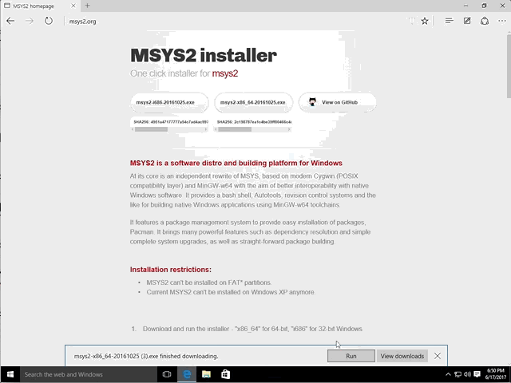
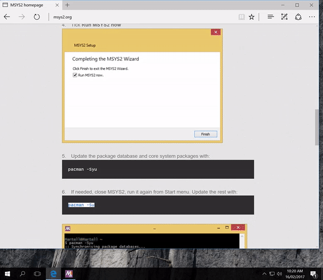

# Getting SplashKit installed on your system.

1. Download the correct version of [MSYS](www.msys2.org) (32bit or 64bit depending on your computer).

    

1. Run the installer

    

1. Follow the installation wizard, with default values.

    

1. Follow the installation steps on the MSYS2 page but executing the command `pacman -Syu`.

    

1. Restart your terminal and relaunch MSYS2, then execute `pacman -su`

    

1. In your MSYS2 Terminal, paste and run the following line: `bash <(curl -s https://raw.githubusercontent.com/splashkit/skm/master/install-scripts/skm-install.sh)`. Found at [splashkit](splashkit.io).

    

1. Restart your terminal, and test that SplashKit installed by executing `skm` in the MSYS2 terminal.

    

1. go to the [dotnet core](https://www.microsoft.com/net/core) page. Select `windows`, `command line/other` then download the `.net core sdk`.

    

1. Run the installer and continue through the install wizard with default values.

    

1. Download [Visual Studio Code](code.visualstudio.com)

    

1. Run the installer.

    

## What's next?
Congratulations! If you've followed these steps correctly, then you will have installed all the tools needed for SIT771.

Don't worry if you run into any problems, just head over to the [forum](http://sit771-discourse.it.deakin.edu.au/) and we'll be able to help you out!